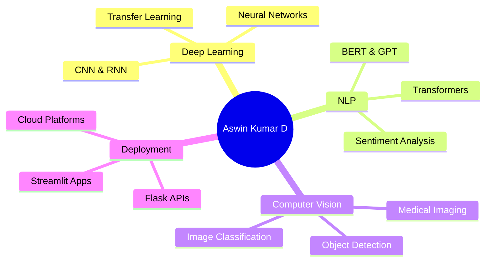

# 👋 Welcome to Aswin Kumar D's GitHub

<div align="center">
  
  

</div>

---

## 🚀 About Me

Hi, I'm Aswin Kumar D! 😄

I’m an AI / ML Trainee at Beleaf Technologies 🤖 

Based in Madurai, Tamil Nadu, India 📍.

🎓 Education: Bachelor of Engineering in Biomedical Engineering with Specialization in Advanced Healthcare Devices

💡 Interests:

🧠 Machine Learning

🤖 Deep Learning

💬 NLP

🏥 Healthcare AI

✨ Generative AI

🚀 Current Focus:

🧠 Building advanced deep learning models

💻 Solving algorithm challenges on LeetCode

🚀 Deploying AI solutions with Flask & Streamlit

📊 Analyzing healthcare & social media data

👋 Let's connect and build amazing AI solutions together!

> **"Driven by data, powered by purpose."**

---

## 🎓 Education & Research Excellence

<table>
<tr>
<td width="50%">

### 📚 Academic Background
- **Bachelor of Engineering** in **Biomedical Engineering** with **Specialization in Advanced Healthcare Devices (Honors)**
- Strong foundation in **Mathematics, Statistics & AI**
- Hands-on experience with **real-world datasets**

</td>
<td width="50%">

### 🏆 Notable Achievements
- ✅ **Outstanding Student Awardee** in **Sethu Institute of Technology**
- ✅ Internships at **Beleaf Technologies** & **Technosolutions pvt ltd**
- ✅ Participation at **Speak For India - Zonal Level**
- ✅ Participation at **Smart India Hackthon - 2022**
- ✅ Presented My Paper at **ICRTICE 2024 Conference**
- ✅ Presented My Paper at **4th International Conference On Biotechnological Emergence in Science & Technology - 2025**


</td>
</tr>
</table>

---

## 💼 Career Objectives

<div align="center">

I'm actively seeking **Internship** or **Full-Time Opportunities** in:

| 🎯 Data Science | 🤖 Machine Learning | 🧬 AI Research | 🔬 NLP & Computer Vision |
|:---:|:---:|:---:|:---:|
| Data Analysis | Model Development | Algorithm Design | Image Processing |
| Visualization | Deep Learning | Paper Implementation | Text Analysis |

</div>

---

## 🛠️ Technical Arsenal

### Languages & Core


### Machine Learning & AI


### Data Science & Visualization


### Frameworks & Tools


### Development Environment


---

## 📈 Current Focus & Learning

<div align="center">



</div>

- 🔥 Building advanced **Deep Learning** models for healthcare
- 💡 Exploring **Transformer architectures** for NLP tasks
- 🚀 Deploying ML models as **production-ready applications**

---

## 🏆 Publications & Research

<details open>
<summary><b>📚 Click to expand my research work</b></summary>

### International Journal Publications

#### 1️⃣ Predictive Modeling in Healthcare using Advanced AI Techniques
**🏅 4th International Conference On Biotechnological Emergence in Science & Technology - 2025**
- Deep learning classification of Multiple Diseases - Pneumonia, Malaria, Skin Cancer, Azheimer, Brain Tumor

#### 2️⃣ Varicosities Warner
**🎖 ICRTICE 2024 Conference**
- Detection of Varicose Vein using various physiological parameters
- Achieved significant improvements in diagnostic accuracy

### Research Categories
- 📝 **Conference Participation**
- 📖 **Journal Publications** 

</details>

---

## 🔬 Featured Projects

### Predictive Model in Healthcare using Advanced AI Techniques (Conference - Published)
```
📊 Machine Learning | 🤖 Deep Learning | Healthcare | 📈 Time Series Analysis
```
- Utilizing **Random Forest** and advanced regression algorithms
- Historical agricultural data analysis for crop yield forecasting
- Provides actionable insights for agribusiness stakeholders
- **Status:** Manuscript in preparation

### 🏃 AI Based Agricultural Disease Prediction (JOURNAL - In Progress)
```
🤖 Deep Learning | 🎯 Activity Recognition
```
- Robust ML model
- High accuracy in predicting diseases
- Applications in agriculture
- **Status:** Under review

### 🔗 More Projects
Visit my profile to explore all projects!

---

## 🏅 Activities & Certifications

<div align="center">
  
- ✅ Completed **Foundation of Machine Learning** - **Professional Certificate**
- ✅ Completed **Deep Learning with Tensorflow** - **Professional Certificate**
- ✅ Completed **Additional Internships** in **Vadamalayan Multispeciality Hospital, KAV Biomedical Education & Equipment Centre**


- ✅ **President** - **BESTA Association** in **Department of Biomedical Engineering**
- ✅ **Initiative Club** - **Executive Member**
- ✅ **NSS** - **Coordinator**
- ✅ **Event Organised** - **TEXPO 2K22, TEXPO 2K23, TEXPO 2K24**


</div>

---

## 🌐 Connect With Me
<div align="center">
  
**Mail**: aswinkumardoffl@gmail.com
**LinkedIn** : www.linkedIn/in/aswinkumar-d-1b99044235

</div>

---

## 📫 Let's Collaborate!

<div align="center">

### 🤝 Open for Opportunities

I'm actively looking for opportunities to contribute to meaningful projects in:
- 🏥 **Healthcare AI** - Improving diagnostics and patient care
- 📱 **Social Media Analytics** - Understanding user behavior and trends
- 🔬 **Research Collaborations** - Pushing the boundaries of AI/ML
- 💼 **Industry Projects** - Building production-ready ML solutions

**Feel free to reach out if you have an exciting project or opportunity!**

--

---


</div>


<div align="center">
  
  **Last Updated:** October 2025
  
  *Made with ❤️ by Aswin Kumar D*
  

