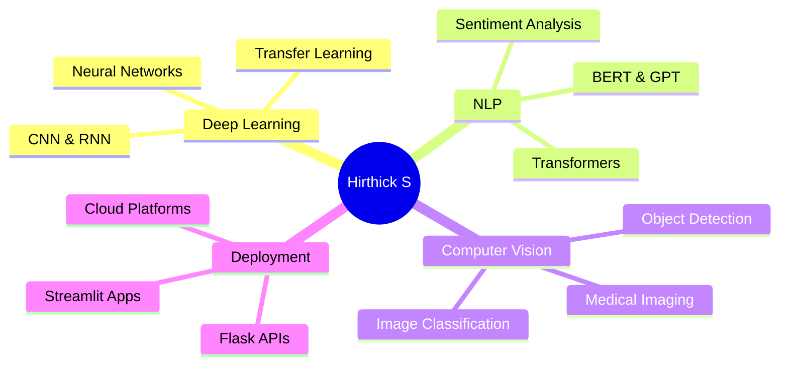

# 👋 Welcome to Aswin Kumar D's GitHub

<div align="center">
  
  

  [](https://github.com/Hirthick6)
  
</div>

---

## 🚀 About Me

```python
class HirthickS:
    def __init__(self):
        self.name = "Hirthick S"
        self.role = "Data Science Scholar"
        self.location = "Madurai, Tamil Nadu, India"
        self.education = "Bachelor of Science in Data Science"
        self.interests = ["Machine Learning", "Deep Learning", "NLP", "Healthcare AI"]
        
    def current_focus(self):
        return [
            "🧠 Advanced Deep Learning Projects",
            "💻 Competitive Coding on LeetCode",
            "🚀 Deploying AI Solutions with Flask & Streamlit",
            "📊 Healthcare & Social Media Analytics"
        ]
    
    def say_hi(self):
        print("Thanks for visiting! Let's connect and build something amazing together!")

me = HirthickS()
me.say_hi()
```

> **"Driven by data, powered by purpose."**

---

## 🎓 Education & Research Excellence

<table>
<tr>
<td width="50%">

### 📚 Academic Background
- **Bachelor of Science** in Data Science
- Strong foundation in Mathematics, Statistics & AI
- Hands-on experience with real-world datasets

</td>
<td width="50%">

### 🏆 Notable Achievements
- ✅ **Published Author** in International Journals
- ✅ Internships at **IIT Kanpur** & **IIIT Allahabad**
- ✅ **5+ Research Publications** in AI/ML domains

</td>
</tr>
</table>

---

## 💼 Career Objectives

<div align="center">

I'm actively seeking **Internship** or **Full-Time Opportunities** in:

| 🎯 Data Science | 🤖 Machine Learning | 🧬 AI Research | 🔬 NLP & Computer Vision |
|:---:|:---:|:---:|:---:|
| Data Analysis | Model Development | Algorithm Design | Image Processing |
| Visualization | Deep Learning | Paper Implementation | Text Analysis |

</div>

---

## 🛠️ Technical Arsenal

### Languages & Core


### Machine Learning & AI


### Data Science & Visualization


### Frameworks & Tools


### Development Environment


---

## 📈 Current Focus & Learning

<div align="center">



</div>

- 🔥 Building advanced **Deep Learning** models for healthcare
- 💡 Exploring **Transformer architectures** for NLP tasks
- 🎯 Solving problems on **LeetCode** daily
- 🚀 Deploying ML models as **production-ready applications**

---

## 🏆 Publications & Research

<details open>
<summary><b>📚 Click to expand my research work</b></summary>

### International Journal Publications

#### 1️⃣ Brain Tumor Analysis Adopting Deep Learning Classifier
**🏅 IGI Global Publication**
- Deep learning classification based on Glioma, Meningioma, and Pituitary parameters
- [📄 Read Paper →](https://www.igi-global.com/gateway/chapter/341072)

#### 2️⃣ Deep Learning Advancements in Malaria Diagnosis
**🎖 IET Journal Publication**
- PyTorch-based ensemble approach for image classification
- Achieved significant improvements in diagnostic accuracy
- [📄 Read Paper →](https://ietresearch.onlinelibrary.wiley.com/doi/10.1049/cit2.12376)

#### 3️⃣ Real-Time Startup Success Predictor
**📖 Conference Paper**
- Using Support Vector Machines and Neural Networks
- Real-time prediction system for startup viability
- [📄 Read Paper →](https://link.springer.com/chapter/10.1007/978-981-97-3242-5_6)

### Research Categories
- 📝 **Conference Participation**
- 📖 **Journal Publications** 
- 📚 **Book Chapter Publication**
- 🏅 **IGI Global Publication**
- 🎖 **IET Journal Publication**

</details>

---

## 🔬 Featured Projects

### 🌾 Crop Prediction Model (JOURNAL - In Progress)
```
📊 Machine Learning | 🌱 Agriculture | 📈 Time Series Analysis
```
- Utilizing **Random Forest** and advanced regression algorithms
- Historical agricultural data analysis for crop yield forecasting
- Provides actionable insights for agribusiness stakeholders
- **Status:** Manuscript in preparation

### 🏃 Accelerometer-Based Human Activity Prediction (JOURNAL - In Progress)
```
🤖 Deep Learning | 📱 Sensor Data | 🎯 Activity Recognition
```
- Robust ML model using accelerometer data
- High accuracy in classifying human activities
- Applications in health monitoring and fitness tracking
- **Status:** Under review

### 🔗 More Projects
Visit my [**GitHub Repositories**](https://github.com/Hirthick6?tab=repositories) to explore all projects!

---

## 📊 GitHub Statistics

<div align="center">
  
  
  
  
  
  

</div>

---

## 🏅 Achievements & Certifications

<div align="center">

| 🎯 Competitive Programming | 📜 Certifications | 🏆 Hackathons |
|:---:|:---:|:---:|
| LeetCode Active | Python Advanced | Multiple Participations |
| Problem Solving | ML Specialization | Project Showcases |
| Algorithm Design | Deep Learning | Team Collaborations |

</div>

---

## 🌐 Connect With Me

<div align="center">

[](mailto:hirthicksoffical@gmail.com)
[](https://linkedin.com/in/hirthicks)
[](https://github.com/Hirthick6)
[](your-resume-link)

</div>

---

## 💡 Fun Facts & Interests

```javascript
const hirthick = {
    hobbies: ["Coding", "Research", "Problem Solving", "Learning New Tech"],
    funFact: "I debug code faster than I debug my life! 😄",
    motto: "Driven by data, powered by purpose",
    currentlyLearning: ["Advanced Deep Learning", "MLOps", "Cloud Computing"],
    askMeAbout: ["Machine Learning", "Deep Learning", "NLP", "Computer Vision"],
    reachOut: "Always open to collaborate on innovative AI projects!"
};
```

---

## 📫 Let's Collaborate!

<div align="center">

### 🤝 Open for Opportunities

I'm actively looking for opportunities to contribute to meaningful projects in:
- 🏥 **Healthcare AI** - Improving diagnostics and patient care
- 📱 **Social Media Analytics** - Understanding user behavior and trends
- 🔬 **Research Collaborations** - Pushing the boundaries of AI/ML
- 💼 **Industry Projects** - Building production-ready ML solutions

**Feel free to reach out if you have an exciting project or opportunity!**

---

### ⭐ If you find my work interesting, consider giving a star to my repositories!


---


</div>

---

**👨‍💻 All of my projects are available at [https://github.com/Hirthick6](https://github.com/Hirthick6)**

<div align="center">
  
  **Last Updated:** October 2025
  
  *Made with ❤️ by Hirthick S*
  
</div>
